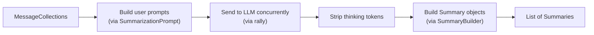
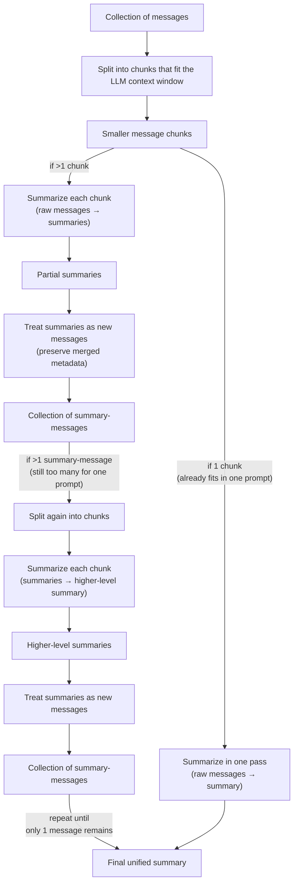

# Summarization

**Subpackage:** `kygs.summarization`

**Description:** A subpackage for summarizing collections of messages using an LLM. It supports two strategies — direct (single-pass) and recursive (map-reduce) — and provides abstractions for customizing how prompts are built and how LLM responses are turned into `Summary` objects.

## Main concepts

### Summarization

**Base entity:** Abstract base class `BaseSummarization` in `kygs.summarization.base`

**Description:** A callable that takes a list of `MessageCollection` objects and returns a list of `Summary` objects (one per collection). It is the top-level entry point for any summarization workflow. Two concrete implementations are provided:

- `DirectSummarization` — single-pass summarization
- `RecursiveSummarization` — map-reduce style summarization that handles collections exceeding the LLM context window

### Summary

**Base entity:** Dataclass `Summary` in `kygs.summarization.base`

**Description:** A simple container holding the summary `text` (string) and its associated `metadata` (a `Metadata` object). Summaries are the output of every summarization strategy. A utility function `to_message_collection` converts a list of `Summary` objects back into a `MessageCollection` (each summary becomes a `Message` with author `"summarizer"`), which enables the recursive summarization loop.

### Summary builder

**Base entity:** Abstract base class `BaseSummaryBuilder` in `kygs.summarization.direct`

**Description:** A strategy that constructs a `Summary` from raw LLM response text and the source collection's metadata. This decouples response parsing from the summarization logic. The provided implementation `PlainSummaryBuilder` simply wraps the text and metadata into a `Summary` with no post-processing. Custom builders can parse structured LLM outputs (e.g., extracting specific fields from a JSON response). An additional implementation `AnnotatedSummaryBuilder` parses JSON responses containing both a summary and multilabel annotations, storing the labels in `Summary.metadata` under a configurable key (default: `"annotation_labels"`).

### Split strategy

**Base entity:** Abstract base class `SplitStrategy` in `kygs.split_strategy`

**Description:** A strategy that divides a flat list of `Message` objects into a list of `MessageCollection` objects, each representing a logical group. Splitting happens before summarization so that each group gets its own summary. Available implementations:

- `TimeSplitStrategy` — groups messages by time intervals (e.g., hourly, daily)
- `LabelSplitStrategy` — groups messages by their label field
- `NoSplitStrategy` — puts all messages into a single collection
- `PrecomputedSplitStrategy` — uses pre-built splits provided at construction time

### Summarization prompt

**Base entity:** Abstract base class `BaseSummarizationPrompt` in `kygs.summarization.direct`

**Description:** A strategy for constructing the user prompt sent to the LLM. It holds a `system_prompt` and a `user_prompt_template` (with a `{messages_as_json}` placeholder). Subclasses define how each `Message` is serialized to a dict via the abstract method `turn_message_to_dict`, and the base class handles JSON-encoding and template formatting. Available implementations:

- `OnlyMessageSummarizationPrompt` — serializes each message as `{"message": <text>}`, omitting timestamps (used when summarizing partial summaries)
- `TimeBasedSummarizationPrompt` — serializes each message as `{"time": <formatted_time>, "message": <text>}`, including timestamps (used when summarizing original time-stamped messages)
- `AnnotatedSummarizationPrompt` — extends `BaseSummarizationPrompt` to also inject a `{labels}` placeholder into the user prompt template, providing the LLM with a list of annotation classes. Used in the summarize-and-annotate mode to produce both a summary and multilabel annotations for the entire message collection. Messages are serialized as `{"message": <text>}`.

## Functionality

### Direct summarization

**Description:** Single-pass summarization strategy. For each `MessageCollection`, a user prompt is built via the configured `BaseSummarizationPrompt`, all prompts are sent to the LLM concurrently via `rally`, thinking tokens are stripped from responses, and a `Summary` is produced via the configured `BaseSummaryBuilder`. Empty collections are skipped.

**Flowchart:**

### Recursive summarization

**Description:** Map-reduce style summarization for collections that exceed the LLM context window. It uses two separate `DirectSummarization` instances — one configured for summarizing original messages and one for summarizing partial summaries — recognizing that these are different tasks requiring different prompts.

The algorithm works as follows: the input `MessageCollection` is partitioned into chunks that fit within `max_characters_in_prompt`. Each chunk is summarized independently (using the original-message prompt on the first pass, and the partial-summary prompt on subsequent passes). The resulting summaries are converted back into a `MessageCollection` via `to_message_collection`, and the process repeats until only one message (the final summary) remains.

Two error conditions are handled: `OutOfContextLengthException` (a single message exceeds the character limit) and `LackOfConvergenceException` (partitioning doesn't reduce the number of items, so the recursion cannot converge).

**Flowchart:**

### Summarize and annotate

**Description:** A mode that combines summarization with multilabel annotation of entire message collections. It uses the same recursive map-reduce architecture but configures the first-pass prompt (`AnnotatedSummarizationPrompt`) and builder (`AnnotatedSummaryBuilder`) to instruct the LLM to return a JSON response containing both a summary and a list of labels. On subsequent recursive passes, plain summarization (without annotation) is used since annotations are only meaningful for original messages.

The list of available label classes is defined in a labels config (e.g., `config/labels/llm_sentiment.yaml`) and is injected into the first-pass prompt template. The LLM assigns zero or more labels to the entire collection, and the resulting labels are stored in `Summary.metadata[metadata_key]` where `metadata_key` is configurable via `config/summary_builder/annotated.yaml` (default: `"annotation_labels"`).

**Entry point:** `kygs/scripts/summarize_and_annotate_posts.py` with config `config/config_summarize_and_annotate_posts.yaml`.
